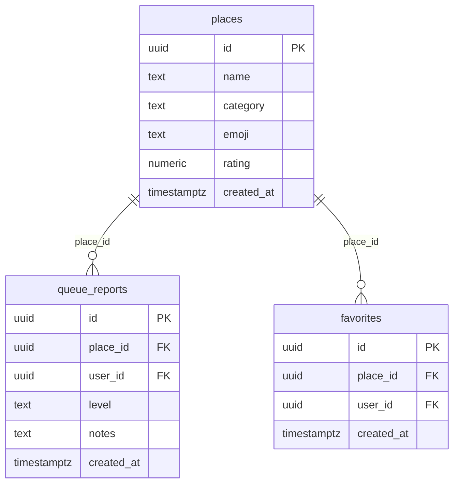

# QueueGo

אפליקציית React לדיווח ובדיקת אורך התור בזמן אמת במקומות עם תור פיזי בכניסה - חנויות בקניון, סופרמרקטים ומקומות אוכל.

**Live Demo:** [queuego-react-app.vercel.app](https://queuego-react-app.vercel.app)  
**GitHub:** [github.com/lihilevii/queuego-react](https://github.com/lihilevii/queuego-react)

---

## הבעיה

אתם יוצאים לקנייה בסופר, קפיצה לקניון או לתפוס משהו לאכול - ונתקעים בתור ארוך שלא ציפיתם לו. QueueGo פותרת את זה: אנשים שנמצאים במקום מדווחים על אורך התור בזמן אמת, וכל השאר רואים כמה עמוס עוד לפני שהם יוצאים מהבית.

## קהל יעד

- **קונים ולקוחות** שרוצים לתפוס את השעה הפחות עמוסה ולחסוך עמידה בתור
- **מבקרים קבועים** שרוצים לדעת מתי הסניף או החנות שלהם פנויים יותר

---

## מתחרים וחלופות

| שירות | מה הוא עושה | מה חסר בו לעומת QueueGo |
|---|---|---|
| "זמני שיא" בגוגל (Popular Times) | מראה שעות עומס ממוצעות לפי היסטוריה | הערכה סטטיסטית, לא דיווח חי מאנשים שנמצאים שם עכשיו |
| Waze / Google Maps | עומסי תנועה בכבישים | לא מכסה תורים בתוך חנויות, סופר או מסעדות |
| אפליקציות של הרשתות (שופרסל, רמי לוי וכו') | קנייה אונליין ומבצעים | לא מראות כמה עמוס בסניף הפיזי כרגע |
| WhatsApp קבוצות שכונתיות | עדכונים ידניים בקבוצה | לא מאורגן, קשה לחפש ולסנן לפי מקום |

**היתרון של QueueGo:** דיווח חברתי מהיר + עדכון Realtime - יודעים כמה עמוס לפני שיוצאים מהבית.

---

## פיצ'רים

- **בית** - חיפוש וסינון מקומות לפי קטגוריה, זמני המתנה חיים עם עדכון Realtime
- **דיווח** - שליחת רמת עומס (נמוך / בינוני / גבוה) עם הערות + מייל אישור אוטומטי
- **מועדפים** - שמירת מקומות עם לחצן לב
- **פרופיל** - היסטוריית דיווחים וסטטיסטיקות
- **אימות** - הרשמה/כניסה עם אימייל וסיסמה (התחברות עם Google בקרוב - התשתית מוכנה בקוד)

---

## Tech Stack

| Layer | Technology |
|---|---|
| Frontend | React 19 + Vite |
| Routing | React Router v7 |
| Database | Supabase (PostgreSQL) |
| Auth | Supabase Auth (Email + Password; Google OAuth בתכנון) |
| Real-time | Supabase Realtime (WebSockets) |
| Email | EmailJS |
| Deployment | Vercel |

---

## שירותים חיצוניים ואינטגרציות

| שירות | סוג | מה הוא מספק לפרויקט |
|---|---|---|
| Supabase Auth | אותנטיקציה | הרשמה/כניסה עם אימייל וסיסמה (תשתית Google OAuth מוכנה בקוד, תופעל בהמשך); ניהול sessions |
| Supabase Realtime | API (WebSockets) | כשמשתמש מדווח על תור, כל המשתמשים רואים את זה מיד ללא רענון דף |
| EmailJS | API | שליחת מייל אישור מעוצב ב-RTL למשתמש אחרי כל דיווח, ישירות מהדפדפן |

---

## מסד הנתונים (ERD)

שלוש טבלאות ב-Supabase עם Row Level Security (RLS):



**קשרים:**
- `queue_reports.place_id` → `places.id`
- `queue_reports.user_id` → `auth.users.id`
- `favorites.place_id` → `places.id`
- `favorites.user_id` → `auth.users.id`

> ראה `/supabase/schema.sql` לכל ה-SQL כולל RLS policies ו-seed data.

---

## הרצה מקומית

### 1. Clone והתקנה

```bash
git clone https://github.com/lihilevii/queuego-react.git
cd queuego-react
npm install
```

### 2. משתני סביבה

צור קובץ `.env.local` בתיקיית הפרויקט:

```
VITE_SUPABASE_URL=https://your-project.supabase.co
VITE_SUPABASE_ANON_KEY=your-anon-key

VITE_EMAILJS_SERVICE_ID=your-service-id
VITE_EMAILJS_TEMPLATE_ID=your-template-id
VITE_EMAILJS_PUBLIC_KEY=your-public-key
```

### 3. הגדרת Supabase

1. צור project ב-[supabase.com](https://supabase.com)
2. SQL Editor - הרץ את `/supabase/schema.sql`
3. Authentication → Providers - (אופציונלי) הפעל Google OAuth לכניסה עם Google
4. Realtime - הרץ: `alter publication supabase_realtime add table queue_reports;`

### 4. הגדרת EmailJS

1. צור חשבון ב-[emailjs.com](https://emailjs.com)
2. הוסף Email Service וצור Template עם המשתנים: `{{to_email}}`, `{{to_name}}`, `{{place_name}}`, `{{queue_level}}`, `{{notes}}`
3. העתק Service ID, Template ID ו-Public Key ל-`.env.local`

### 5. הרצה

```bash
npm run dev
```

---

## Deployment

האפליקציה deployed ל-Vercel עם CI/CD אוטומטי מ-GitHub.  
כל push ל-`main` מפעיל deploy חדש אוטומטית.
